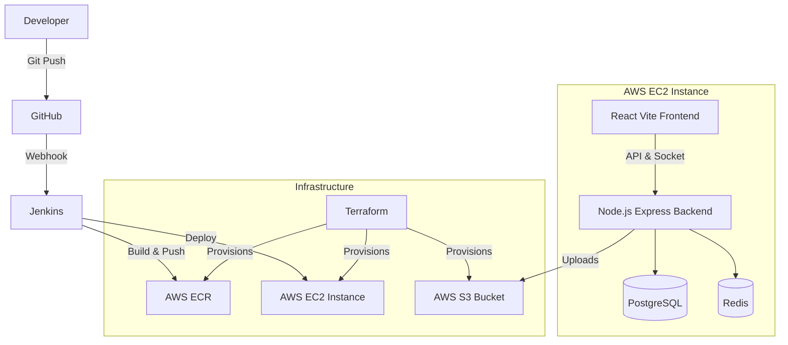

# Virtual Study Cafe ☕📚

A full-stack, real-time virtual study environment where students can join study rooms, chat via Socket.IO, and upload files. This project is fully containerized and deployed to AWS with a complete CI/CD pipeline and Infrastructure as Code.

## 🏗️ Architecture Overview

This project was built from the ground up using modern DevSecOps practices. 



## 🚀 Tech Stack

### Frontend
- **React (Vite)**
- **TailwindCSS** (or Vanilla CSS)

### Backend
- **Node.js & Express**
- **Socket.IO** (Real-time Chat & Room Events)
- **PostgreSQL** (Relational Database)
- **Redis** (In-Memory Caching)

### DevOps & Cloud (AWS)
- **Docker & Docker Compose** (Containerization)
- **AWS EC2** (Hosting)
- **AWS S3** (Object Storage for file uploads)
- **AWS ECR** (Elastic Container Registry)
- **Jenkins** (Automated CI/CD Pipeline)
- **Terraform** (Infrastructure as Code)

## 🛠️ Features
- **Real-Time Study Rooms**: Join rooms and chat instantly using Socket.IO.
- **File Sharing**: Upload and download study materials (stored securely in AWS S3).
- **Authentication**: Secure login and signup system.
- **CI/CD Automation**: Any push to the `main` branch automatically triggers Jenkins to build and deploy the latest Docker images.
- **Infrastructure as Code**: The entire AWS infrastructure can be spun up or destroyed with a single `terraform apply` or `terraform destroy`.

## 💻 Local Development

1. Clone the repository:
   ```bash
   git clone https://github.com/JustusFaby/brain-brew.git
   ```
2. Run the application using Docker Compose:
   ```bash
   docker compose up -d --build
   ```
3. Access the application:
-Frontend App: http://100.24.8.222:5173
-Backend API: http://100.24.8.222:5000
-Jenkins CI/CD: http://100.24.8.222:8080

## ☁️ Infrastructure (Terraform)

To provision the AWS infrastructure yourself:
1. Install Terraform and AWS CLI.
2. Navigate to the `terraform/` directory.
3. Run `terraform init`
4. Run `terraform apply`

When finished, ensure you run `terraform destroy` to clean up resources.
